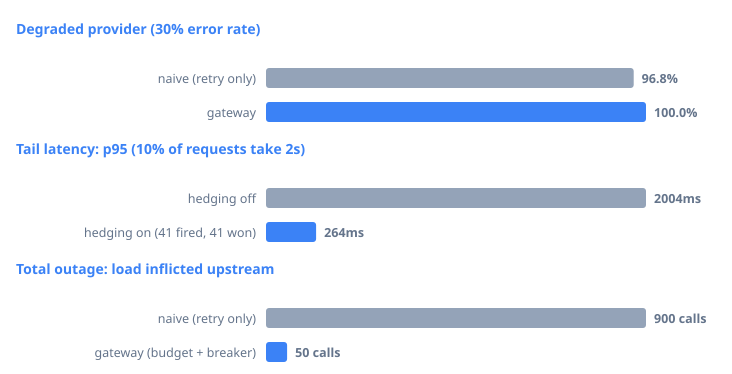
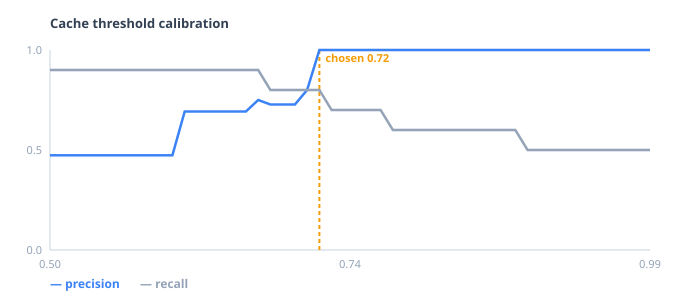

# LLM Gateway

**A reliability-focused proxy for LLM providers: hedged requests, circuit breaking, retry budgets, and a semantic cache that is calibrated rather than guessed.**

Against a provider failing **30% of requests**, the gateway sustains a **100% success rate**
while cutting p95 latency from **237ms → 63ms**. Hedging cuts p95 tail latency **7.5×** for
10% extra upstream calls. During a total outage it inflicts **18× less load** on the failing
provider than a conventional retry loop.

Every number here is reproducible on your machine in under a minute, with **no API keys and no Docker**:

```bash
pip install -e ".[dev]" && python -m chaos.run
```



---

## Measured results

Each row is an A/B against an identical provider with an identical random seed, so the only
variable is the reliability layer. `upstream` counts requests that actually reached a
provider — the cost axis, reported so the price of each mechanism is visible.

**Degraded provider — 30% error rate, 400 requests**

| | success | p50 | p95 | upstream calls |
|---|---|---|---|---|
| Naive retry loop | 96.8% | 63ms | 237ms | 587 |
| **Gateway** | **100.0%** | **62ms** | **63ms** | 549 |

**Tail latency — 10% of requests take 2s, 400 requests**

| | p50 | p95 | p99 | upstream calls |
|---|---|---|---|---|
| Hedging off | 62ms | 2006ms | 2008ms | 400 |
| **Hedging on** | 62ms | **268ms** | **270ms** | 441 (+10%) |

> 41 hedges fired, 41 won. A **7.5× p95 improvement for 10% extra upstream calls** — because
> the hedge only fires on requests already proven slow.

**Total outage — provider 100% down, 300 requests**

| | upstream calls |
|---|---|
| Naive retry loop | 900 |
| **Gateway** (retry budget + circuit breaker) | **50** |

> Nobody succeeds here; that's the point. The question isn't "who stays up" but "who makes
> the outage worse." A naive retry loop **triples** load on a provider that is already
> failing — that's a retry storm.

## Why this exists

Most LLM proxies focus on routing and cost tracking. This one focuses on the harder problem:
**staying up when providers don't.**

| Mechanism | Fixes | Why the others don't help |
|---|---|---|
| Retry | A request that failed | — |
| Failover | A provider that failed | Retrying a dead provider just fails again |
| **Hedging** | A request that is merely **slow** | Nothing has failed, so there's nothing to retry |
| Retry budget | Retries *becoming* the outage | Per-request retry limits can't see system-wide load |
| Circuit breaker | Paying a full timeout per doomed request | — |
| Single-flight | A cache stampede on a cold key | Caching alone doesn't help when everyone misses at once |

Hedging is the centrepiece. Tail latency usually comes from one unlucky *instance*, not a
slow *service* — so the fix is to stop waiting and ask someone else, while keeping the
original in flight in case it lands first.

## Providers

Two adapters ship, proving the abstraction holds across genuinely different
wire formats:

| Adapter | Covers | Notes |
|---|---|---|
| `OpenAICompatProvider` | Groq, Together, Fireworks, OpenRouter, vLLM, Ollama | One adapter, change the base URL |
| `GeminiProvider` | Google Gemini | Different schema entirely: `contents`/`parts`, no system role, header auth |

Both are tested against recorded wire formats using `httpx.MockTransport`, so
the real request-building, status-mapping and SSE-parsing code runs **with no
network and no API keys**.

The status mapping is the contract between a provider and the reliability
layer, and it is where naive HTTP clients quietly go wrong:

| Upstream | Classified as | Consequence |
|---|---|---|
| 429 | `RateLimitError` | Retryable, honouring `Retry-After` |
| 5xx, 408, 409, 425 | `TransientProviderError` | Retryable, counts against the breaker |
| Other 4xx | `PermanentProviderError` | Never retried, never trips the breaker |
| Timeout / connection reset | `TransientProviderError` | Fails over |

Set `GATEWAY_GROQ_API_KEY` or `GATEWAY_GEMINI_API_KEY` (both have free tiers)
and real providers take priority in the failover order, with mocks appended as
a last resort — so the gateway is useful with keys and still demonstrable
without them.

## Observability

`GET /metrics` exposes Prometheus series for request outcomes and latency
histograms, per-provider token consumption, cache hit/miss/skip, hedge
counters, and circuit-breaker state per provider.

Every label has a small bounded value set. A label carrying prompts or user ids
would grow time series until scrapes time out — cardinality explosion takes
down monitoring exactly when it is needed.

## The semantic cache

A hit rate on its own is a meaningless number: set the threshold to zero and you get 100%
hits and a broken product. So the cache ships with an evaluation harness that sweeps the
similarity threshold against a labelled set of paraphrases and hard negatives, and picks an
operating point deliberately.



```bash
python -m chaos.cache_bench
```

**Operating point: 0.72 — 100% precision, 80% recall.** Chosen as the *lowest threshold with
perfect precision*, not the best F1. F1 treats a false hit and a false miss as equally bad,
and they are not: a false hit returns a **wrong answer to a user**, while a false miss costs
one API call.

Hit rate depends on traffic shape, so the benchmark reports the sensitivity rather than one
flattering headline (Zipf s=1, 1500 requests):

| distinct prompts | upstream calls | hit rate |
|---|---|---|
| 200 | 177 | 88.2% |
| 600 | 340 | 77.3% |
| 2,000 | 555 | 63.0% |
| 6,000 | 671 | 55.3% |

### The bug the evaluation caught

The first version of this benchmark reported a **flat ~92% hit rate regardless of how
diverse the traffic was** — which is impossible, and the tell that something was wrong.

The cause: prompts differing only by an identifier. `restart service 41` and
`restart service 87` are ~99% similar under any embedder, because the token that
distinguishes them carries the least lexical weight. The cache was serving one tenant's
answer to another. Raising the threshold didn't fix it — it destroyed recall while *still*
leaking false hits.

The fix is structural, not a tuning knob. Identifiers are extracted from the prompt and
made part of the cache namespace, so prompts about different entities can never be compared
whatever their vectors say: **semantic matching for wording, exact matching for entities.**
Four regression tests cover it.

That is why the sensitivity table above now falls from 88% to 55% as traffic diversifies —
the earlier flat curve was measuring false hits.

## The subtle part: streaming can't fail over

A normal request is atomic — if it fails, retry silently and the client never knows.
**A stream is not.** Once the first chunk ships, the client has seen part of an answer;
failing over now would splice two different answers together.

So the executor tracks a commit point. Before the first chunk, failover is safe. After it,
errors propagate. There's also no HTTP status left to use — the `200` went out with the
first byte — so mid-stream errors are delivered as an SSE error event.

## Running it

```bash
pip install -e ".[dev]"

pytest                          # 61 tests, incl. property-based
mypy && ruff check .            # strict, clean
python -m chaos.run             # reliability benchmarks
python -m chaos.cache_bench     # cache calibration
uvicorn gateway.main:app        # OpenAI-compatible API on :8000
```

```bash
curl localhost:8000/v1/chat/completions \
  -H 'content-type: application/json' \
  -d '{"messages":[{"role":"user","content":"hello"}]}'
```

`GET /healthz` exposes live breaker states, retry-budget headroom, hedge counters, and cache
statistics.

The gateway runs on built-in mock providers by default. Real embeddings
(`pip install -e ".[embeddings]"`) are used when available and fall back to a zero-dependency
lexical embedder otherwise — including when the package is installed but *unusable*, which
is a real failure mode this project hit on Windows.

## Design decisions

- **The mock provider is a first-class component, not a test fixture.** You cannot ask a real
  provider to fail 30% of requests on command, so you cannot demonstrate a circuit breaker
  against one. Every benchmark here exists because the mock does.
- **Permanent errors are never retried and never counted against the breaker.** A malformed
  request is the client's fault; letting it trip the breaker would let one bad client take a
  healthy provider offline for everyone.
- **Retry budgets over per-request retry counts.** Per-request limits are fine when one
  request fails and catastrophic when everything does.
- **Losing hedges are cancelled in a `finally` block.** Otherwise every hedged request keeps
  burning upstream tokens for a response nobody will read.
- **Cache thresholds are per-embedder**, because different embedders score similarity on
  different scales and one global constant cannot be right for both.
- **Optional dependencies degrade, never crash.** An installed-but-broken embedding backend
  falls back with a warning instead of killing application startup.

## Docs

- [`docs/DEFENDING.md`](docs/DEFENDING.md) — the reasoning behind every design decision, an
  asyncio primer, and the questions these numbers invite.

## Testing

The tests target failure modes, not happy paths:

```
test_breaker_half_open_admits_exactly_one_probe   10 concurrent callers, exactly 1 probe
test_budget_blocks_retry_storm                    retries collapse during an outage
test_budget_never_exceeds_allowance               property-based (Hypothesis)
test_hedge_fires_only_when_primary_is_slow        hedging triggers on latency
test_no_hedge_when_primary_is_fast                and NOT on healthy traffic
test_losing_hedge_is_cancelled                    no leaked tasks, no wasted tokens
test_stream_fails_over_before_first_chunk         commit-aware failover
test_different_identifiers_never_match            no cross-tenant cache hits
test_namespace_prefix_cannot_collide              entity "1" vs entity "12"
test_single_flight_collapses_concurrent_duplicates  50 requests -> 1 upstream call
test_handles_concurrent_load                      100 requests, nothing serialised
test_client_errors_are_permanent                  401/400 never retried
test_rate_limit_honours_retry_after               provider backoff respected
test_stream_skips_keepalives_and_malformed_chunks SSE robustness
test_gemini_handles_safety_filtered_response      no KeyError on filtered output
test_hedge_counters_only_ever_increment           counters never move backwards
```

## Status

Working: async FastAPI service, OpenAI-compatible API, SSE streaming with commit-aware
failover, circuit breaker with single-probe recovery, sliding-window retry budget, hedged
requests with cancellation, full-jitter backoff, semantic cache with entity guarding and
calibration harness, single-flight deduplication, Groq/OpenAI-compatible and Gemini
adapters, Prometheus metrics, configurable mock provider, chaos benchmarks. CI on
Python 3.12 and 3.13. 61 tests.

Next: persistent cost ledger, adaptive hedge delay tracking rolling p95.

## License

MIT
